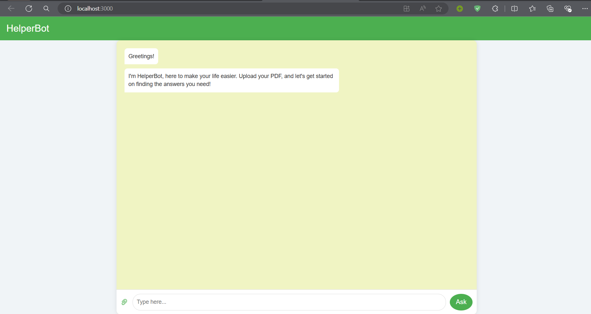
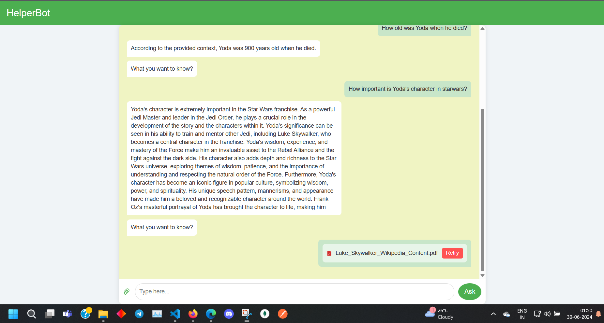

# Description
HelperBot : An ChatBot (a simple form of multi-tenant RAG application) which allows user to upload pdfs and helps them answer any queries and questions related to the content present inside the pdfs.

**Tools used :**
- Backend => FastAPI
- Frontend => React.js
- NLP Processing => Langchain
- PDF Processing => PyPDF2
- LLM => [Meta-Llama-3-70B](https://huggingface.co/meta-llama/Meta-Llama-3-70B)
- Embedding Model => [mixedbread-ai/mxbai-embed-large-v1](https://huggingface.co/mixedbread-ai/mxbai-embed-large-v1)


Watch this Demo video to see the basic working of the application :
[video](https://drive.google.com/file/d/18GvjMQWgqLshPNFEddBZfNOTk7EghfOL/view?usp=sharing)

**Setup**
1)  Clone the Repository

2) Run these commands to run the backend server.
    ```console
    cd server
    python -m venv env
    .\env\Scripts\activate
    pip install -r requirements.txt
    uvicorn main:app --reload
    ```
    Note : Before running last command, ensure added all these environment variables(your own api keys) in a .env file inside server directory.
    - INFERENCE_API_KEY
    - GROQ_API_KEY
    - PINECONE_API_KEY
    - PINECONE_ENVIRONMENT
    - PINECONE_INDEX_NAME
    - CHOOSE_VETOR_STORE (1 for using Chroma and 2 for Pinecone Vector Stores)

3) Then in another terminal run these commands to run the frontend server
    ```console
    cd client
    npm install
    npm start
    ```
4) Your server would be running on http://127.0.0.1:8000 and frontend on http://127.0.0.1:3000. Visit the frontend link and start using HelperBot.


Here are some screenshots of some of the features

1) Homepage :
    

2) Uploading Pdfs : 
    i) If files uploaded was not a pdf then 
    

    ii) If files uploaded were all pdfs then
        a) Processing pdfs
        
        b) Asking queries 
        
        
        c) If there is error during uploading
        

